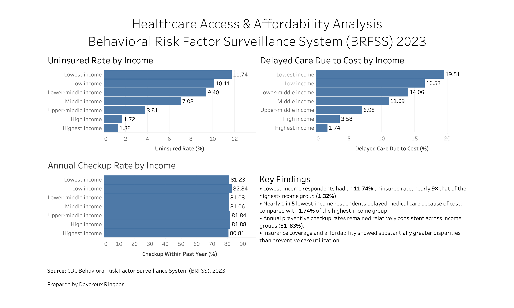

# Emergency Department Analytics Dashboard

## Project Overview

This project analyzes emergency department (ED) operations using patient visit and triage data from the MIMIC-IV Emergency Department database. SQL was used to transform and aggregate operational data, while Tableau was used to develop an interactive dashboard that identifies patient arrival patterns, emergency department length of stay, and triage acuity trends to support operational decision-making.

## Interactive Dashboard

Explore the interactive Tableau dashboard:

https://public.tableau.com/views/HospitalOperations_17849217157260/HospitalEDOpereationsDashboard?:language=en-US&:sid=&:redirect=auth&:display_count=n&:origin=viz_share_link

## Objectives

- Analyze emergency department patient arrival patterns
- Evaluate average length of stay by triage acuity
- Identify peak patient arrival hours
- Visualize key operational metrics through an interactive dashboard

## Tools & Technologies

- PostgreSQL
- SQL
- Tableau
- Microsoft Excel

## Business Questions

- When does emergency department demand peak?
- How does patient acuity affect length of stay?
- Which patient groups require the greatest operational resources?
- How can operational data support staffing and resource planning?

## Dashboard Preview

## Key Findings

- Patient arrivals varied throughout the day, with peak volumes occurring during midday and afternoon hours.
- Higher-acuity patients generally experienced longer emergency department stays than lower-acuity patients.
- Operational trends identified through the dashboard can support staffing and resource allocation decisions.

## Repository Contents

- **Dashboard/** – Tableau workbook
- **SQL/** – SQL scripts used to clean and analyze the data
- **Data/** – Processed datasets used for visualization
- **Images/** – Dashboard screenshots

## Data Source

MIMIC-IV-ED Demo v2.2, PhysioNet (Beth Israel Deaconess Medical Center & MIT Laboratory for Computational Physiology).

## Skills Demonstrated

- SQL querying
- Data aggregation
- Data cleaning
- PostgreSQL
- Tableau
- Healthcare operations analytics
- KPI development
- Dashboard design
- Data visualization
